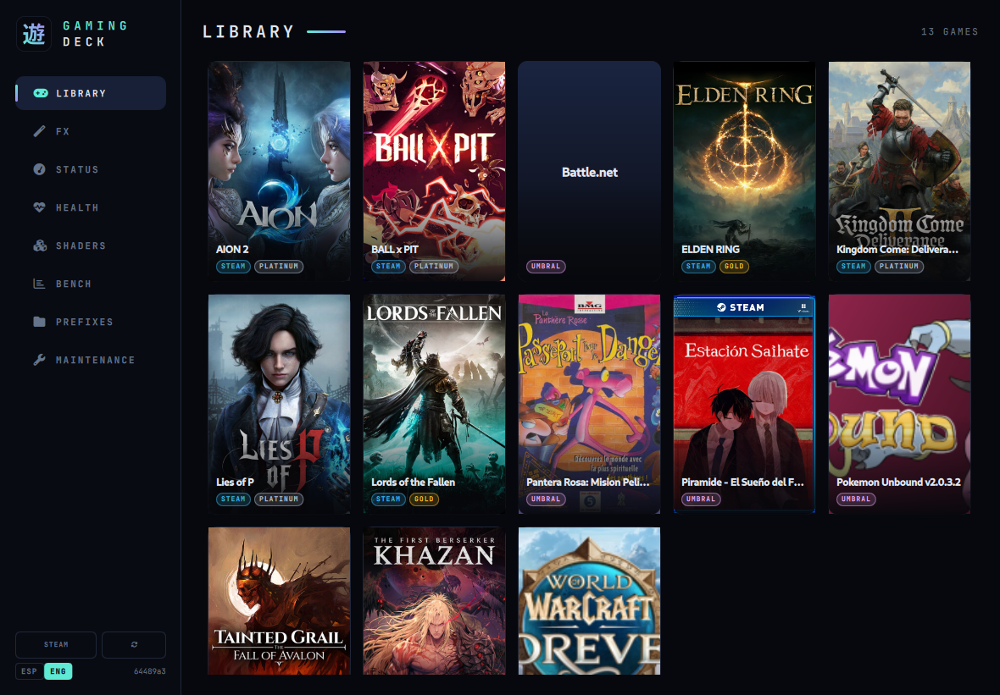
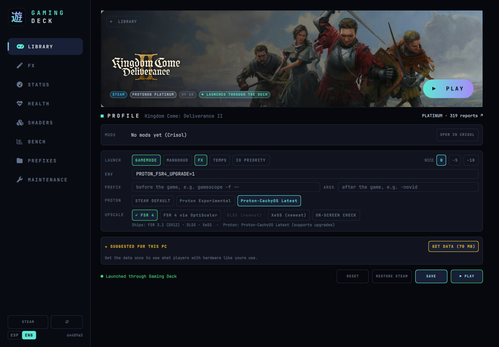
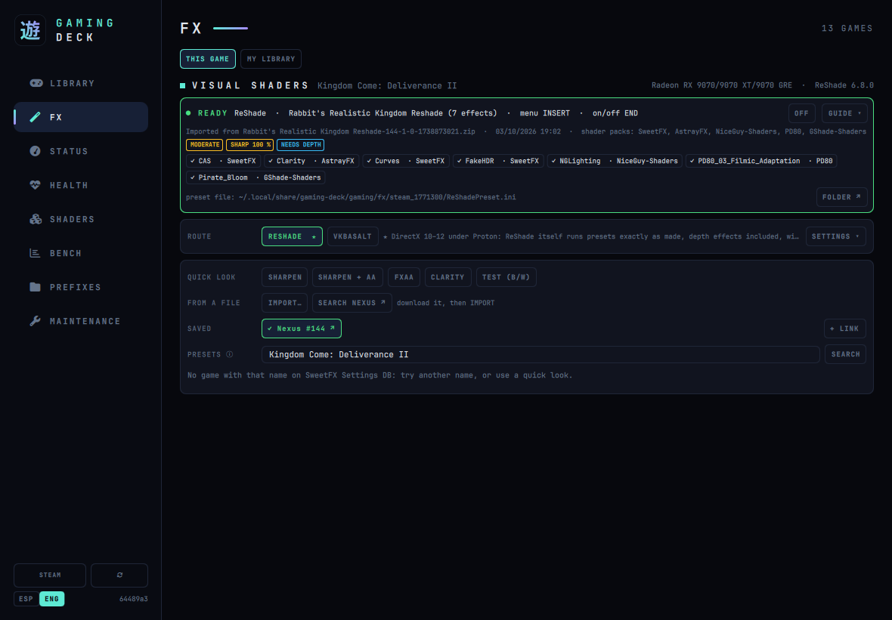
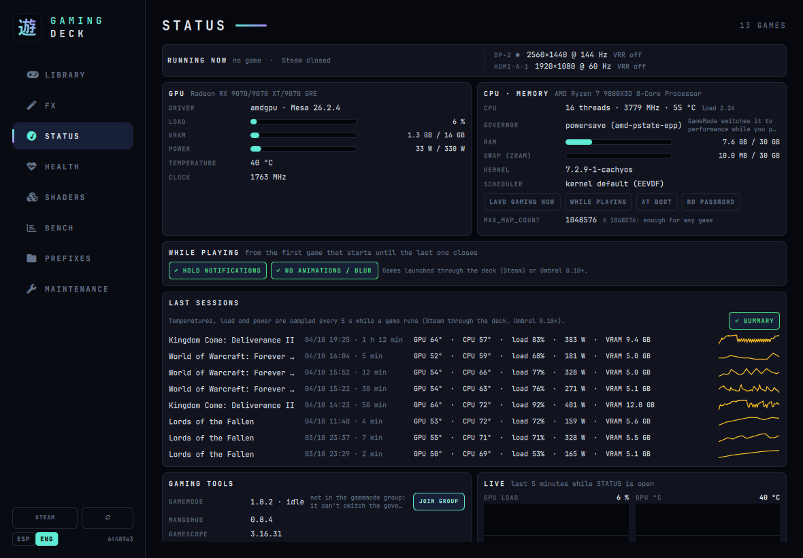
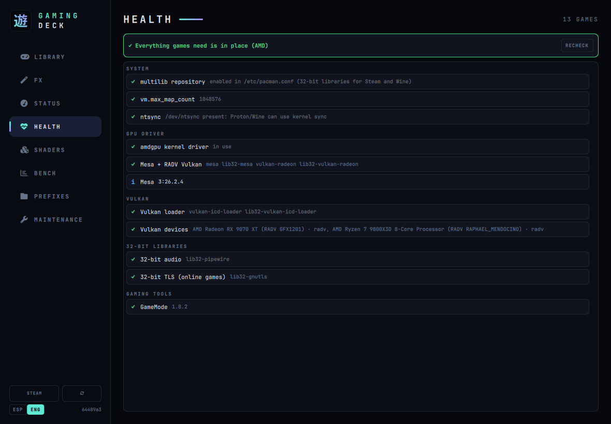
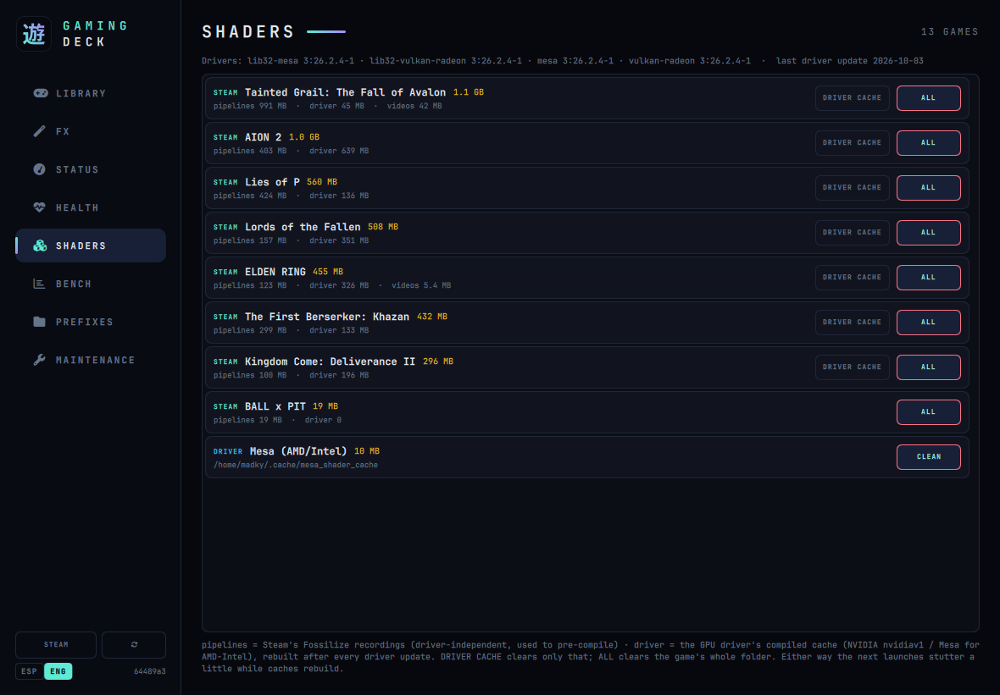
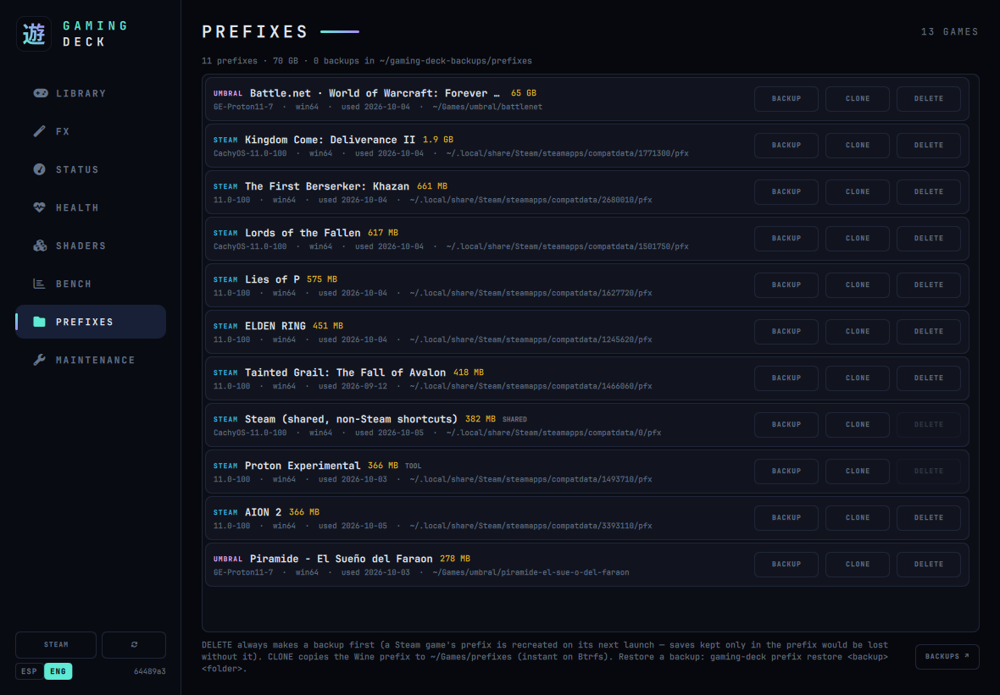
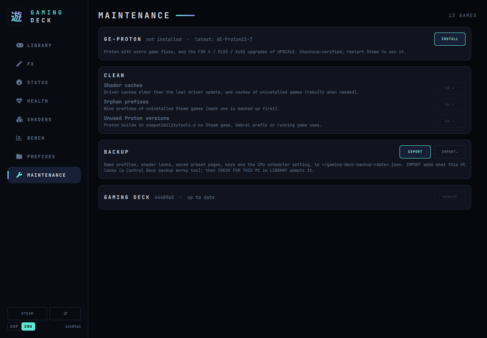

<p align="center"></p>

# 遊 Gaming Deck

[](https://github.com/madkyp/gaming-deck/actions/workflows/tests.yml)


[](https://github.com/madkyp/umbral-project)

**Per-game profiles, visual shaders and gaming status for Steam and [Umbral](https://github.com/madkyp/umbral-project) games on Arch / CachyOS**, with a [QuickShell](https://quickshell.outfoxxed.me/) UI (Wayland / Hyprland): your library as covers, each game's page with its launch profile, **ReShade / vkBasalt** looks, **FSR 4 / DLSS / XeSS** upgrades and mods, live GPU/CPU status, a health check of what games need, and the game-side clean-up.

Gaming Deck was the GAMING tab of **Control Deck**, which became two apps: **[System Deck](https://github.com/madkyp/system-deck)** (install, manage, update and clean up your apps) and Gaming Deck. Installing Gaming Deck brings your game profiles, looks and ReShade over by itself (see [From Control Deck](#-from-control-deck)).

> 🤖 **This project was built with the help of AI.** See the [disclaimer](#-disclaimer) below.

---

## ✨ Features

The sidebar has eight sections, in English or Spanish (**ESP / ENG** at the bottom):

- **LIBRARY**: every installed Steam game and every Umbral game as a **cover** (Steam's own artwork; Umbral's covers), with its store, ProtonDB tier and whether it has a look. A game's **page** shows its banner and logo, ▶ **PLAY**, and everything below.
- **LIBRARY**: your installed Steam games — plus the games of [Umbral](https://github.com/madkyp/umbral-project) (Battle.net and games from no store) — with size, **ProtonDB** rating for Steam games (public summary, cached 24 h), the Proton version each one uses, and **▶ PLAY** to start any of them from its own launcher.
- **Per-game profile**: gamemode, MangoHud, IO priority, nice, environment variables, a prefix (e.g. `gamescope -f --`) and extra arguments. **USE IN STEAM** turns the game's current launch options into its profile and makes Steam launch it through `gaming-deck run %command%` (**RESTORE STEAM** undoes it). Nothing it changes outlives the game: the CPU governor is handled by gamemode's daemon, which restores it even if the game crashes.
- **PLAYERS USE**: launch options suggested from ProtonDB's open data (ODbL) — for each game, the share of players **with hardware like this PC** (same GPU vendor, ±1 generation) who report it works and use each option. Options used by ≥ 20 % of them are marked **★ RECOMMENDED FOR THIS PC**; the hardware is detected every time, so the same install recommends different things on an NVIDIA laptop and an AMD desktop. Values like `-threads` or `-w`/`-h` are adapted to this CPU and screen, and vendor-only variables (`RADV_*`, NVAPI…) only show on that vendor. The data covers ~6 900 games, so games you install later get suggestions too, and new games are flagged in the library. Click a suggestion to add it, then SAVE; nothing is applied on its own.
- **Proton version per game**, from the ones you have installed (Steam must be closed; a backup of its config is kept).
- **UPSCALE** (per game): **FSR 4**, **DLSS** or **XeSS** upgrades through GE-Proton / Proton-CachyOS — Proton downloads the newest DLLs itself, nothing to install by hand. Each option is offered only when the game ships the right DLL, the GPU supports it (FSR 4: Radeon RX 9000; DLSS: RTX) and the game's Proton can do it; otherwise it says why. **FSR 4 via OptiScaler** brings FSR 4 to games that only offer DLSS/XeSS/FSR 2 (RX 9000; never offered with anti-cheat), again set up by Proton.
- **When a game ends**: games launched through the deck are watched until they close — a crash raises a notification with the error code and where the log is, and a **session summary** (time played, max temperatures, load, power) is sent and kept in STATUS → LAST SESSIONS.
- **SHADERS**: every game's shader cache split into Steam's pipeline recordings and the GPU driver's compiled cache (NVIDIA or Mesa for AMD/Intel), with **stale** caches (not used since the last driver update) and **orphans** (uninstalled games) detected and cleanable. System Deck warns before an update that changes the GPU driver.
- **BENCH**: A/B benchmark of two launch variants (env, args, gamemode, Proton) with MangoHud frame logs: average FPS, 1 % / 0.1 % lows, p99 frametime and both frametime curves side by side.
- **PREFIXES**: every Wine/Proton prefix (Steam, Heroic, Faugus, Bottles, standalone) with size, last use, version and orphans (games no longer installed); backup, instant clone (Btrfs reflink), restore, and delete with an automatic backup first.
- **TEMPS** (per game, on the game's page): a one-line `CPU 54° · GPU 51°` readout at the top right while the game runs — the deck's own overlay (a Quickshell layer above fullscreen games, click-through, amber from 75 °C, red from 85 °C), not MangoHud. It closes with the game.
- **FX** (visual shaders), per game: **ReShade** itself (downloaded from reshade.me, installed as links next to the game's .exe — API and 32/64-bit detected from the executable — loaded through Proton with DLL overrides, removed cleanly with OFF) or **vkBasalt** (a Vulkan layer). Quick looks (CAS sharpening, SMAA/FXAA, clarity) and **per-game presets from SweetFX Settings DB**, with the shaders they need fetched from the official packages. Presets downloaded by hand (e.g. from Nexus Mods: zip, 7z, rar or .ini) are **imported** in one click, with the shaders they bring. Free community packs that ReShade's own list lacks (e.g. NiceGuy-Shaders) are fetched too, and the black-and-white **TEST** look shows at once that the effects are drawn. **★ marks the right tool for each game** (ReShade or vkBasalt) and says why — e.g. a Vulkan game needs vkBasalt, a 2D RPG Maker game can't be hooked by either. When a game is set up, a single **READY** line shows the look and its keys; otherwise only the next step is shown. ReShade screenshots go to `~/Pictures/ReShade/<game>`. AMD and NVIDIA alike. Online games get a warning, anti-cheat ones a red one and a confirmation click. The menu key is configurable. **MY LIBRARY** scans every game — best preset on SweetFX DB by downloads, ReShade compatibility and depth settings from PCGamingWiki, anti-cheat risk — and **SET UP ALL** installs ReShade with them on every single-player game in one go (anti-cheat games are never touched).
- **HEALTH**: what games need from the system — multilib, GPU driver (NVIDIA versions in sync after updates, `nvidia_drm modeset`; Mesa/RADV on AMD, AMDVLK warning), Vulkan devices, 32-bit libraries, `vm.max_map_count`, ntsync. Read-only: each problem shows the exact fix command with a COPY button.
- **STATUS** (live, refreshed every 3 s while open): the game running now (uptime, Proton build, ReShade/vkBasalt in use, GameMode), **GPU** (driver, load, VRAM, power vs limit, temperature, clocks and what is holding it back — NVIDIA via nvidia-smi, AMD via amdgpu sysfs), **CPU · memory** (model, MHz, temperature, governor, RAM, swap/zram, kernel, `vm.max_map_count` and the **CPU scheduler**: switch to sched-ext **LAVD Gaming** now, only **WHILE PLAYING**, or **AT BOOT**), **LAST SESSIONS** (summary of each game session with a temperature graph), **WHILE PLAYING** (opt-in: hold notifications — dunst pause or swaync Do Not Disturb — and turn Hyprland's animations, blur and shadows off from the first game that starts until the last one closes; only what the deck changed is put back), **display** (resolution, Hz, VRR) and **gaming tools** (GameMode with a one-click **JOIN GROUP**, MangoHud, gamescope, Steam, ntsync, Proton builds, shaders), with a shortcut to HEALTH.
- **Mods**: with **[Crisol](https://github.com/madkyp/crisol-app)** (the author's mod manager) installed, a game's page shows its mods (how many are on, the profile, pending changes, updates, a missing mod loader) with **PLAY WITH MODS** and **OPEN IN CRISOL**.
- **Umbral games** ([Umbral](https://github.com/madkyp/umbral-project) ≥ 0.10.0) get TEMPS, FX, the scheduler and the session summary too: Umbral asks the deck for them each time it starts a game. With Umbral ≥ 0.11 the deck knows exactly which of its games are running (no guessing by .exe name) and can close them (**■ STOP** in STATUS). With Umbral ≥ 0.12 their GameMode, MangoHud, Wayland, FPS limit and variables are edited from LIBRARY too, and CHECK FOR THIS PC fixes them.
- **MAINTENANCE**: **GE-Proton** (installed version, latest release, install/update — checksum-verified), the game **clean-up** (stale and orphan shader caches, orphan prefixes, Proton versions nothing uses), a **backup** of profiles, looks and settings (export / import, also from an old Control Deck backup), and Gaming Deck's own update.

> 🔔 Desktop notifications (`notify-send`) when each operation finishes.

---

## 📸 Screenshots

| LIBRARY | GAME PAGE |
|---|---|
|  |  |

| FX | STATUS |
|---|---|
|  |  |

| HEALTH | SHADERS |
|---|---|
|  |  |

| PREFIXES | MAINTENANCE |
|---|---|
|  |  |

## 🌑 Umbral compatibility

Gaming Deck is compatible with **[Umbral](https://github.com/madkyp/umbral-project)** (`github.com/madkyp/umbral-project`), a GTK launcher for Battle.net (World of Warcraft…) and for Windows games from no store, running with Proton. Install both and they work together: Umbral's games show up in the LIBRARY next to Steam's.

| Umbral | What Gaming Deck does with its games |
|---|---|
| any | LIBRARY lists them (size, playtime, prefix and Proton) and ▶ PLAY starts them through Umbral; PREFIXES shows their prefixes with the game using each one, and flags the ones no game uses |
| ≥ 0.10 | Umbral asks the deck for **FX** (ReShade / vkBasalt) and **TEMPS** when it starts a game; the CPU scheduler *while playing*, *while playing* quiet notifications / lighter Hyprland and the **session summary** follow the game |
| ≥ 0.11 | Exact **running games** from Umbral's `running.json` (pids with their start time, no guessing by `.exe` name) and **■ STOP** in STATUS |
| ≥ 0.12 | A game's **options edited from LIBRARY** (GameMode, MangoHud, Wayland, FPS limit, variables) through `umbral --get / --set`, and **CHECK FOR THIS PC** fixing them after moving to another PC |

Nothing is needed on Gaming Deck's side: it finds `umbral` in your `PATH` and reads `~/.config/umbral/config.json`. With an older Umbral, the features it doesn't support yet stay read-only. How the two talk to each other is described in Umbral's README ("Integration") and in [`docs/gaming.md`](docs/gaming.md).

> Umbral releases from before the split call `control-deck` for FX, TEMPS and the session: those parts come back once Umbral calls `gaming-deck` (planned). Listing, playing, prefixes, running games, STOP and the options from the page work with any of them.

---

## 🧩 Requirements

**Required:** [`quickshell`](https://quickshell.outfoxxed.me/) `>= 0.3`, `bash`, `coreutils`, `jq`, `libarchive` (`bsdtar`), `curl`, `polkit` + a graphical agent, a **Nerd Font** (*JetBrainsMono Nerd Font*), and Steam.

**Optional:** `gamemode` (+ `lib32-gamemode`), `mangohud` (+ `lib32-mangohud`), `gamescope`, `vkbasalt` (+ `lib32-vkbasalt`, offered in FX), `libnotify`, `zenity` (IMPORT file chooser), `python` (reads a game's .exe to pick ReShade's API), `scx-tools` (CPU scheduler), [Umbral](https://github.com/madkyp/umbral-project), [Crisol](https://github.com/madkyp/crisol-app).

---

## 🚀 Installation

```bash
git clone https://github.com/madkyp/gaming-deck.git
cd gaming-deck
./install.sh
```

`install.sh` checks the dependencies (asking before installing anything), copies the backend to `~/.local/bin/gaming-deck`, the UI to `~/.config/quickshell/gaming-deck/`, the TEMPS overlay, the launcher and the icon, and — once — brings your game data over from Control Deck. `./install.sh --no-deps` only copies the files.

**Update:** *● NEW VERSION* appears in the sidebar; MAINTENANCE → UPDATE. By hand: `git pull && ./install.sh --no-deps`.

**Uninstall:** `./uninstall.sh` (your profiles, looks and ReShade stay in `~/.local/share/gaming-deck`).

## 🔁 From Control Deck

`gaming-deck migrate` (run by the installer) moves `gaming/`, `reshade/` and `sessions/` from `~/.local/share/control-deck` to `~/.local/share/gaming-deck`, fixes what pointed at the old folder — the paths in each game's `ReShade.ini`, the ReShade DLL links next to its `.exe`, vkBasalt configs — and switches the Steam launch options from `…/control-deck run %command%` to `…/gaming-deck run %command%`. Steam rewrites its files when it closes, so that last step waits for **Steam to be closed**: the installer says so, and running `gaming-deck migrate` again finishes it. Backups of every file it changes are kept (`*.gaming-deck.bak`).

## 🖱️ Usage

- From your app launcher: **"Gaming Deck"** — or `qs -c gaming-deck`.
- Open straight on a section: `GAMING_DECK_VIEW=fx qs -c gaming-deck` (`status`, `health`, `shaders`, `bench`, `prefixes`, `maint`).
- Full CLI: `gaming-deck help`. Steam calls `gaming-deck run %command%` for the games set up with **USE IN STEAM**.

## 🏗️ How it works

**Script backend + thin GUI**: `bin/gaming-deck` (bash, every action as a command with JSON output) and `quickshell/shell.qml` (the UI, which only shows state and calls the backend). Design notes, what each module checks and what's been verified on real hardware (RTX 2070 and RX 9070 XT): [`docs/gaming.md`](docs/gaming.md).

```bash
tests/run.sh
```

The suite runs the backend in a throw-away `$HOME` with stubbed tools (`pacman`, `pkexec`, `curl`, Steam's files, `hyprctl`, `dunstctl`…): no root, no network, nothing on your system is touched. GitHub Actions runs it — plus `shellcheck` — on every push.

## 🤖 Disclaimer

This project was created **with the help of AI** (Anthropic's Claude, through Claude Code). The code was written together with the AI, then reviewed, tested and used on real Arch / CachyOS + Hyprland systems, but it is provided **as is**, without warranty (see the [license](LICENSE)). It edits Steam's config files (with Steam closed, keeping backups), links ReShade's DLL into game folders and can delete shader caches and Wine prefixes (prefixes are backed up first). **Don't use shaders in online games with anti-cheat**: the deck warns, but the risk is yours.

## 📄 License

MIT — see [LICENSE](LICENSE).
